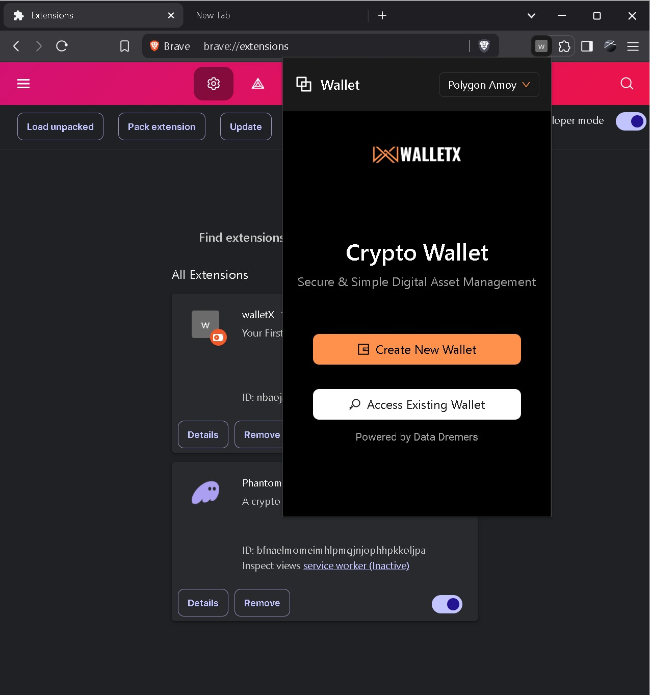

# 🚀 WalletX – Multi-Chain Browser Extension Wallet

## 🖥️Preview 


WalletX is a secure, developer-friendly, multi-chain browser extension wallet built for seamless integration with dApps. Designed with flexibility in mind, WalletX supports Ethereum, Solana, and other blockchain networks, offering developers an easy-to-use API and users a clean, intuitive interface for managing their assets.

---

🏆 **Hackathon Achievement**

WalletX was proudly built and presented during the **Nirama HackNUthon**. Competing against 51 talented teams, we secured a spot in the **Top 10**, finishing **9th overall**. 🚀

---

## ✨ Features

- 🔒 **Secure Key Management** using AES encryption
- 🔗 **Multi-chain Support**: Ethereum, Solana, and more via Web3.js & Ethers.js
- 📦 **Developer API** for easy dApp integration
- 🌐 **Browser Extension** (Manifest V3) compatible with Chrome, Edge, and Firefox
- 📁 **IndexedDB** for secure local storage
- 💡 **IPFS Support** (optional) for decentralized data
- 🧩 **Metamask Snap / WalletConnect Integration**
- 🎨 Sleek UI built with **React.js** and **Tailwind CSS / Material UI**

---

## 🛠️ Tech Stack

| Layer      | Tech Used                          |
| ---------- | ---------------------------------- |
| Frontend   | React.js, Tailwind CSS / MUI       |
| Backend    | Node.js, Express.js                |
| Blockchain | Ethers.js, Solana Web3.js, Web3.js |
| Security   | AES (Crypto.js), WalletConnect     |
| Storage    | IndexedDB, IPFS (optional)         |
| Extension  | Chrome Extension (Manifest V3)     |

---

## 🧑‍💻 How to Use

### 1. Clone the Repository

```bash
git clone
cd WalletX
```

### 2. Install Dependencies

```bash
npm install
```

### 3. Run Development Server

```bash
npm run dev
```

### 4. Load Extension in Chrome

- Go to `chrome://extensions/`
- Enable **Developer Mode**
- Click **Load unpacked**
- Select the `/dist` folder after build

### 5. Build for Production

```bash
npm run build
```

---

## 📚 Developer Guide

- Import WalletX SDK to your dApp
- Use provided API to:
  - Connect wallet
  - Sign transactions
  - Switch networks
  - Retrieve balances

> Full documentation coming soon...

---

## 🧪 Testing

- Unit tests using Jest / Mocha (coming soon)
- Extension compatibility: ✅ Chrome, ✅ Firefox, ✅ Edge

---


---

## 📃 License

MIT License © 2025 WalletX Team

---


-
- 

